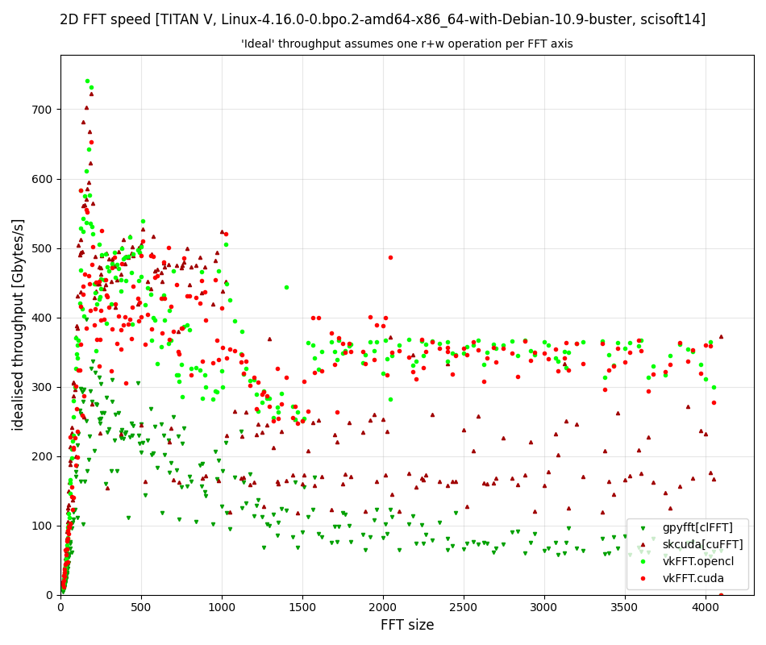

pyvkfft - python interface to the CUDA and OpenCL backends of VkFFT (Vulkan Fast Fourier Transform library)
===========================================================================================================

`VkFFT <https://github.com/DTolm/VkFFT>`_ is a GPU-accelerated Fast Fourier Transform library
for Vulkan/CUDA/HIP/OpenCL.

pyvkfft offers a simple python interface to the **CUDA** and **OpenCL** backends of VkFFT, compatible with pyCUDA and pyOpenCL.

*The code is now in a working state, and passes all unit tests ; no errors are reported by either valgrind or cuda-memcheck.*

Installation
------------

Requirements:

- `vkfft.h` installed in the usual include directories
- `pyopencl` and the opencl libraries for the opencl backend
- `pycuda` and CUDA developments tools (`nvcc`) for the cuda backend (optional)
- `numpy`

This package should be installed using pip or `python setup.py install`.

Examples
--------
See the script and notebook in the examples directory.
The notebook is also `available on google colab
<https://colab.research.google.com/drive/1YJKtIwM3ZwyXnMZfgFVcpbX7H-h02Iej?usp=sharing>`_.
Make sure to select a GPU for the runtime. This may fail on old architectures (Kepler- to be confirmed)

Status
------
What works:

- CUDA and OpenCL backends
- C2C, R2C/C2R for inplace and out-of-place transforms
- single and double precision for all transforms
- all transforms accept 1D, 2D and 3D arrays, with the FT dimension <= array dimension
- allowed prime factors (radix) of the transform axes are 2, 3, 5, 7, 11 and 13
- normalisation=0 (array L2 norm * array size on each transform) and 1 (the backward
  transform divides the L2 norm by the array size, so FFT*iFFT restores the original array)
- now testing the FFT size does not exceed the allowed maximum prime number decomposition (13)
- unit tests for all transforms: use `python setup.py test`
- Note that out-of-place C2R transform currently destroys the complex array for FFT dimensions >=2
- tested on macOS (10.13.6) and Linux.

Performance
-----------
See the benchmark notebook, which allows to plot OpenCL and CUDA backend throughput, as well as compare
with cuFFT (using scikit-cuda) and clFFT (using gpyfft).

Example result for 2D FFT with array dimensions of 16xNxN using a Titan V:

Note that in this plot the computed throughput is theoretical, as if each transform axis for the
couple (FFT, iFFT) required exactly one read and one write. This is obviously not true,
and explains the drop after N=1024 for cuFFT and (in a smaller extent) vkFFT.

The general results are:

* vkFFT throughput is similar to cuFFT up to N=150, then slightly lower up to N=1024. For N>1024
  vkFFT is much more efficient than cuFFT due to the smaller number of read and write per FFT axis
* the OpenCL and CUDA backends of vkFFT perform similarly, as expected
* clFFT (via gpyfft) generally performs much worse than the other transforms. (Note that
  the clFFT/gpyfft benchmark tries all FFT axis permutations to find the fastest combination)

Finally one important advantage of vkFFT is that inplace transforms are truely in-place,
and do not require an extra buffer/staging area contarry to cuFFT, which makes larger FFT
transforms possible (even for R2C !).

TODO
----

- access to the other backends:

  - for vulkan and rocm this only makes sense combined to a pycuda/cupy/pyopencl equivalent.
- support cupy arrays (this probably requires little change so a cupy user/developer contribution is welcome)
- support array dimensions >3 when the FFT dimension is up to 2 (by collapsing the 3rd dimension)
- out-of-place C2R transform without modifying the C array ? This would require using a R array padded with two wolumns, as for the inplace transform
- half precision ?
- convolution ?
- zero-padding ?
- access to tweaking parameters in VkFFTConfiguration ?
- access to the code of the generated kernels ?
